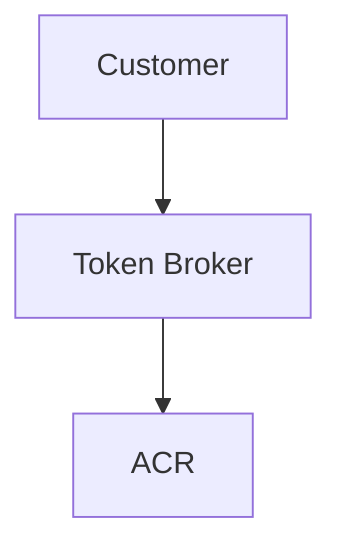

# Diagrams

This directory contains architecture diagrams for the Enterprise Container Registry platform.

## Diagram index

| Diagram | Description | Format | Source |
|---------|-------------|--------|--------|
| `platform-services-architecture.*` | Full platform service stack — 5 layers | SVG / Mermaid | Claude session April 2026 |
| `token-broker-entitlement-flow.*` | Token Broker 3-path sequence diagram | SVG / Mermaid | Claude session April 2026 |
| `supply-chain-security-pipeline.*` | Commit → verified deployment pipeline | SVG / Mermaid | Claude session April 2026 |
| `global-deployment-architecture.*` | Multi-region hub-spoke deployment | SVG / Mermaid | Claude session April 2026 |

## Adding diagrams

Preferred formats (in order):
1. **Mermaid** in `.md` files — renders natively in GitHub, version-controllable as text
2. **SVG** — scalable, diff-friendly, renders inline
3. **Draw.io** `.drawio` + exported `.svg` — commit both

To embed a diagram in a document:
```markdown

```

Or for Mermaid inline in a document:
````markdown

````
